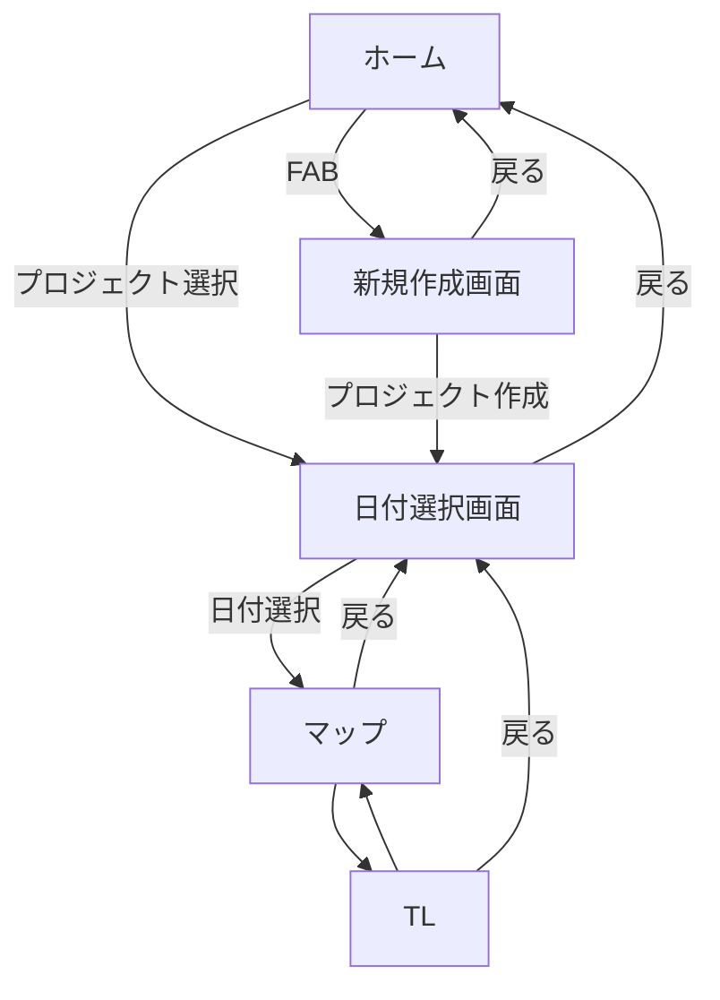

## 1. アプリ概要

- **アプリ名：**
- **目的／概要：**旅
- **想定ユーザー：**
- **プラットフォーム：** Android（Kotlin + Jetpack Compose）
- **開発体制・担当範囲：**

---  

## 2. 開発方針

  
---  

## 3. 機能一覧

| 機能名          | 優先度 | 状態  | 概要  |
| ------------ | --- | --- | --- |
| ルート・タイムライン作成 | 1   | 設計中 |     |
| AIチャット       | 2   | 未着手 |     |
| ナビゲーション      | 3   | 未着手 |     |
| 共有機能         | 4   | 未着手 |     |
| ログイン機能       | 5   | 未着手 |     |
  
---  

## 4. 各機能仕様

### 4.1 ルート・タイムライン作成（優先度1）

**概要**  
　ルートとタイムラインを作成する．マップとTLを行き来できるようにする．

**主なユースケース**

| ユースケース       | 到達目標                                                                                                        |     |
| ------------ | ----------------------------------------------------------------------------------------------------------- | --- |
| 新規プロジェクトを作成  | プロジェクト名と出発日，帰宅日を入力して保存できる                                                                                   |     |
| 既存プロジェクトを選択  | 作成したプロジェクトを読み込める                                                                                            |     |
| 日付を選択        | プロジェクトから各日の予定に遷移できる                                                                                         |     |
| 目的地の追加       | 地図上で目的地を選択できる                                                                                               |     |
| 経路の確認        | 目的地を指定した順に，または最適化された順に回る経路を地図上で確認できる                                                                        |     |
| タイムラインの確認・編集 | タイムラインを確認できる 各目的地の間の移動時間と手段が確認できる 出発時刻と各目的地の滞在時間を入力できる 入力した時間をもとにその日の日程が分単位で確認できる 目的地同士が入れ替えられる |     |

**処理ロジック**
1.
2.
3.
4.

**API設計(サーバー通信する場合)**

| API名 | メソッド | エンドポイント | 用途  | 備考  |
| ---- | ---- | ------- | --- | --- |
|      |      |         |     |     |
|      |      |         |     |     |
|      |      |         |     |     |
|      |      |         |     |     |
|      |      |         |     |     |
  
---  

## 5. 画面設計

### 画面一覧

| 画面名        | 主なUI                                                                                   | 遷移先              |
| ---------- | -------------------------------------------------------------------------------------- | ---------------- |
| ホーム        | 新規作成ボタン 作成済みプロジェクトのリスト                                                              | 新規作成画面 日付選択画面 |
| 新規作成画面     | プロジェクト名入力ボックス 出発日選択（デートピッカー） 帰宅日選択（デートピーカー） 作成ボタン 戻るボタン                    | 日付選択画面 ホーム    |
| 日付選択画面     | 日付選択UI 戻るボタン                                                                        | マップ ホーム       |
| マップ        | マップ 検索ボックス TLへの遷移ボタン 戻るボタン                                                    | TL 日付選択画面     |
| TL（タイムライン） | 目的地のリスト 目的地間の所要時間表示 目的地の到着時間と出発時間表示 出発時間及び各目的地の所要時間の入力 マップへの遷移ボタン 戻るボタン | マップ 日付選択画面    |

### 画面遷移図

  
---  

## 6. 今後の課題・TODO

### 【開発者TODO】
- [ ] Google Maps APIキーを取得し、`AndroidManifest.xml`に設定する。

### UI開発 TODOリスト

#### フェーズ1：基本構造の構築
- [x] **プロジェクトセットアップ**

#### フェーズ2：各画面のUI実装
- [x] **ホーム画面 (`HomeScreen.kt`)**
- [x] **新規作成画面 (`NewProjectScreen.kt`)**
- [x] **日付選択画面 (`DateSelectionScreen.kt`)**
- [x] **マップ画面 (`MapScreen.kt`)**
- [x] **タイムライン画面 (`TimelineScreen.kt`)**

#### フェーズ2.5：UIのブラッシュアップ
- [x] 全体的なデザイントークンの定義と適用
- [x] 各画面のレイアウトやコンポーネントの見た目を、より詳細に画像に合わせて調整
- [x] ホーム画面のプロジェクトリストに編集・削除メニューを追加する
- [ ] 日本語のコメント（KDoc）をすべてのUI関連ファイルに追記する
- [ ] 画面遷移時のアニメーションを追加
- [ ] ローディング状態やエンプティ状態のUIを実装

#### フェーズ3：ロジックとデータ連携
- [ ] **プロジェクト編集機能の実装**
  - [ ] `TripScreen.kt`のナビゲーションを拡張し、`new_project`ルートで`projectId`を渡せるようにする
  - [ ] `NewProjectViewModel`を作成し、`projectId`を受け取って編集対象のデータをロードするロジックを実装する
  - [ ] `NewProjectScreen.kt`を修正し、ViewModelから受け取ったデータを表示し、「編集モード」のUIを実装する（例：ボタンテキストの変更）
- [ ] **ViewModelの作成**
- [ ] **機能ロジックの実装**

---  

## 7. AI用ルール
- 基本原則として，AIはアプリの根幹にかかわる重要な決定を行ってはならない．最終判断は人間の開発者が行う．
- AIはこの設計書に忠実に実装を行い，書いていないことを推測によって実装してはならない．
- 実装を開始する前に，AIは設計書とコードの対応関係を検証し，未定義領域や未指定動作がないことを確認する．
- もしも設計書の内容で曖昧な箇所がある場合，AIは必ず開発者に質問する．その箇所が明確になったら必ず設計書を更新する．
- 全ての箇所が明確になったら，AIはこれから行うことを設計書のTODOリストに追記する．以後はそのTODOリストに従って順番に実装を進める．
- 実装する際，小さなステップごとの実装を心掛ける．
- デザインシステムはMaterial3のみを使用する．
- 入れ子構造は極力避ける．