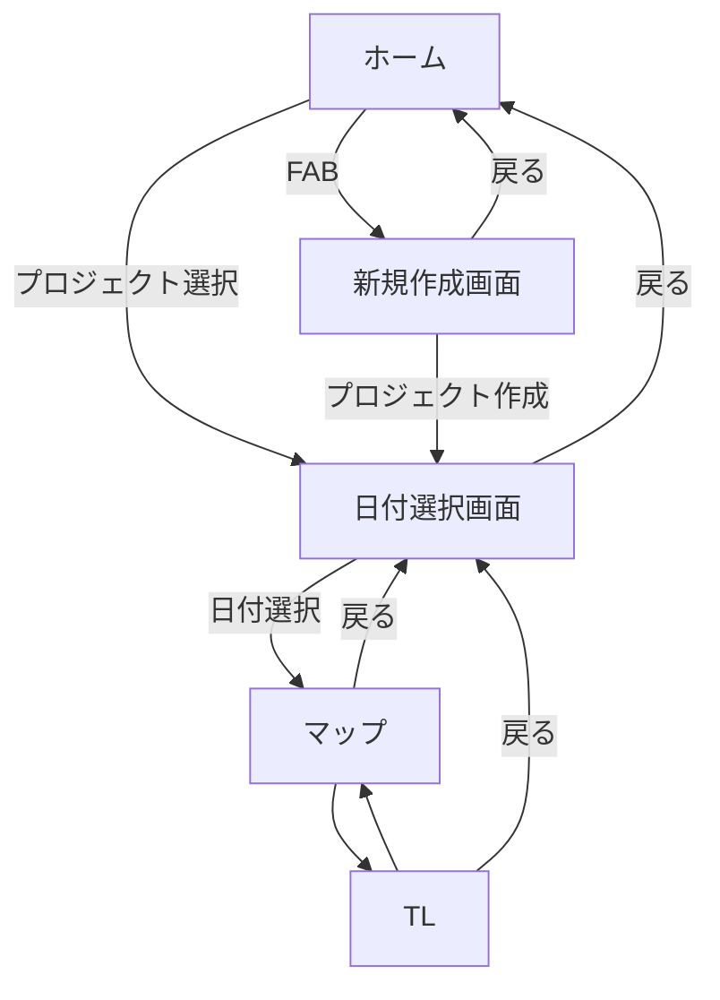

## 1. アプリ概要

- **アプリ名：**
- **目的／概要：**旅
- **想定ユーザー：**
- **プラットフォーム：** Android（Kotlin + Jetpack Compose）
- **開発体制・担当範囲：**

---  

## 2. 開発方針

  
---  

## 3. 機能一覧

| 機能名          | 優先度 | 状態  | 概要  |
| ------------ | --- | --- | --- |
| ルート・タイムライン作成 | 1   | 設計中 |     |
| AIチャット       | 2   | 未着手 |     |
| ナビゲーション      | 3   | 未着手 |     |
| 共有機能         | 4   | 未着手 |     |
| ログイン機能       | 5   | 未着手 |     |
  
---  

## 4. 各機能仕様

### 4.1 ルート・タイムライン作成（優先度1）

**概要**  
　ルートとタイムラインを作成する．マップとTLを行き来できるようにする．

**主なユースケース**

| ユースケース       | 到達目標                                                                                                        |     |
| ------------ | ----------------------------------------------------------------------------------------------------------- | --- |
| 新規プロジェクトを作成  | プロジェクト名と出発日，帰宅日を入力して保存できる                                                                                   |     |
| 既存プロジェクトを選択  | 作成したプロジェクトを読み込める                                                                                            |     |
| 日付を選択        | プロジェクトから各日の予定に遷移できる                                                                                         |     |
| 目的地の追加       | 地図上で目的地を選択できる                                                                                               |     |
| 経路の確認        | 目的地を指定した順に，または最適化された順に回る経路を地図上で確認できる                                                                        |     |
| タイムラインの確認・編集 | タイムラインを確認できる 各目的地の間の移動時間と手段が確認できる 出発時刻と各目的地の滞在時間を入力できる 入力した時間をもとにその日の日程が分単位で確認できる 目的地同士が入れ替えられる |     |

**処理ロジック**

**API設計(サーバー通信する場合)**

| API名 | メソッド | エンドポイント | 用途  | 備考  |
| ---- | ---- | ------- | --- | --- |
|      |      |         |     |     |
|      |      |         |     |     |
|      |      |         |     |     |
|      |      |         |     |     |
|      |      |         |     |     |
  
---  

## 5. 画面設計

### 画面一覧

| 画面名        | 主なUI                                                                                   | 遷移先              |
| ---------- | -------------------------------------------------------------------------------------- | ---------------- |
| ホーム        | 新規作成ボタン 作成済みプロジェクトのリスト                                                              | 新規作成画面 日付選択画面 |
| 新規作成画面     | プロジェクト名入力ボックス 出発日選択（デートピッカー） 帰宅日選択（デートピーカー） 作成ボタン 戻るボタン                    | 日付選択画面 ホーム    |
| 日付選択画面     | 日付選択UI 戻るボタン                                                                        | マップ ホーム       |
| マップ        | マップ 検索ボックス TLへの遷移ボタン 戻るボタン                                                    | TL 日付選択画面     |
| TL（タイムライン） | 目的地のリスト 目的地間の所要時間表示 目的地の到着時間と出発時間表示 出発時間及び各目的地の所要時間の入力 マップへの遷移ボタン 戻るボタン | マップ 日付選択画面    |

### 画面遷移図

### 6.TODO
- Roomを用いたデータ永続化
- JSONをパージしてデータ構造を合わせる
- UseCaseの宣言と実装を分けるのは無駄なのでまとめる
- 日付のデータ構造を追加

