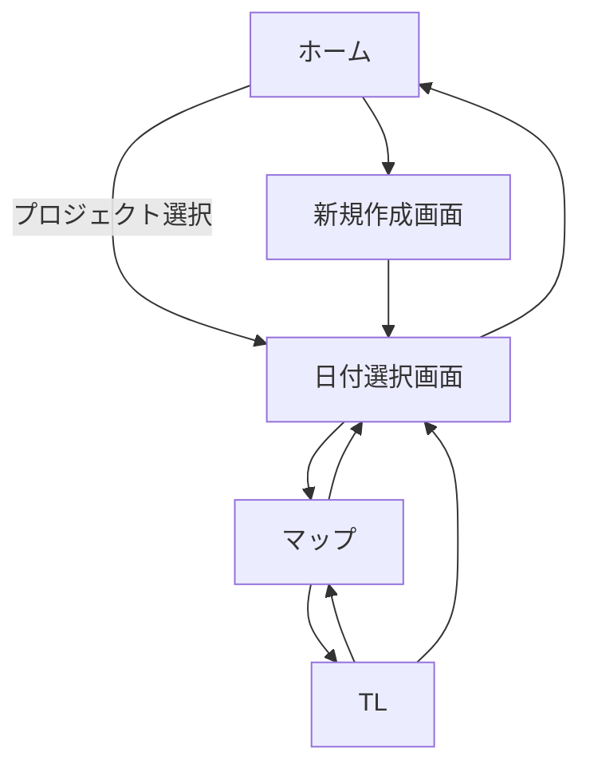

# アプリ側設計書

## 1. アプリ概要

- **アプリ名：**
- **目的／概要：**旅
- **想定ユーザー：**
- **プラットフォーム：** Android（Kotlin + Jetpack Compose）
- **開発体制・担当範囲：**

---

## 2. 開発方針

| 項目 | 内容 |
| --- | --- |
| 言語 | | 
| UI | | 
| サーバー | | 
| 外部API | Google Maps API， |
| データベース | | 
| アーキテクチャ | MVVM |
| 開発ルール | （例：命名規則、バリデーション記述方針など） |

---

## 3. 機能一覧

| 機能名 | 優先度 | 状態 | 概要 |
| --- | --- | --- | --- |
| ルート・タイムライン作成 | 1 | 設計中 | |
| AIチャット | 2 | 未着手 | |
| ナビゲーション | 3 | 未着手 | |
| 共有機能 | 4 | 未着手 | |
| ログイン機能 | 5 | 未着手 | |

---

## 4. 各機能仕様

### 4.1 ルート・タイムライン作成（優先度1）

**概要**

　ルートとタイムラインを作成する．マップとTLを行き来できるようにする．

**主なユースケース**

| ユースケース | 到達目標 |
| --- | --- |
| 新規プロジェクトを作成 | プロジェクト名と出発日，帰宅日を入力して保存できる |
| 既存プロジェクトを選択 | 作成したプロジェクトを読み込める |
| 日付を選択 | プロジェクトから各日の予定に遷移できる |
| 目的地の追加 | 地図上で目的地を選択できる |
| 経路の確認 | 目的地を指定した順に，または最適化された順に回る経路を地図上で確認できる |
| タイムラインの確認・編集 | タイムラインを確認できる
各目的地の間の移動時間と手段が確認できる
出発時刻と各目的地の滞在時間を入力できる
入力した時間をもとにその日の日程が分単位で確認できる
目的地同士が入れ替えられる
 |

**処理ロジック**

1.

2.

3.

4.

**API設計(サーバー通信する場合)**

| API名 | メソッド | エンドポイント | 用途 | 備考 |
| --- | --- | --- | --- | --- |
| | | | | |
| | | | | |
| | | | | |
| | | | | |
| | | | | |

---

## 5. 画面設計

### 画面一覧

| 画面名 | 主なUI | 遷移先 |
| --- | --- | --- |
| ホーム | 新規作成ボタン 作成済みプロジェクトのリスト | 新規作成画面 日付選択画面 |
| 新規作成画面 | プロジェクト名入力ボックス 出発日選択（デートピッカー） 帰宅日選択（デートピッカー） 作成ボタン 戻るボタン | 日付選択画面 ホーム |
| 日付選択画面 | 日付選択UI 戻るボタン | マップ ホーム |
| マップ | マップ 検索ボックス TLへの遷移ボタン 戻るボタン | TL 日付選択画面 |
| TL（タイムライン） | 目的地のリスト 目的地間の所要時間表示 目的地の到着時間と出発時間表示 出発時間及び各目的地の所要時間の入力 マップへの遷移ボタン 戻るボタン | マップ 日付選択画面 |

### 画面遷移図

   

---

## 6. 今後の課題・TODO

### 【開発者TODO】
- [ ] Google Maps APIキーを取得し、`AndroidManifest.xml`に設定する。

### UI開発 TODOリスト

#### フェーズ1：基本構造の構築
- [x] **プロジェクトセットアップ**
    - [x] Jetpack Compose用のNavigationライブラリを導入する。
    - [x] `設計書.md`の画面遷移図に基づき、各画面のComposable関数とナビゲーションルートを定義する (`NavHost`のセットアップ)。

#### フェーズ2：各画面のUI実装
- [x] **ホーム画面 (`HomeScreen.kt`)**
    - [x] `ホーム画面.png`を参考に、画面の基本レイアウトを作成する。
    - [x] 「新規作成」ボタンを配置する。
    - [x] 「作成済みプロジェクトの呼び出し」エリア（リスト形式など）を設ける。
- [x] **新規作成画面 (`NewProjectScreen.kt`)**
    - [x] `目的地作成画面.png`を参考に、画面の基本レイアウトを作成する。
    - [x] プロジェクト名を入力する`TextField`を配置する。
    - [x] 出発日・帰宅日を選択するためのUIを配置する（タップするとデートピッカーを表示）。
    - [x] `デートピッカー画面.png`を参考に、`DatePickerDialog`を実装する。
    - [x] 「作成」ボタンを配置する。
- [x] **日付選択画面 (`DateSelectionScreen.kt`)**
    - [x] `スケジュール画面.png`を参考に、プロジェクトの日程を選択するUI（タブやリストなど）を作成する。
- [x] **マップ画面 (`MapScreen.kt`)**
    - [x] `出発地.png`や`目的地１.png`などを参考に、画面レイアウトを作成する。
    - [x] Google Maps for Compose を利用して地図を表示する。
    - [x] 上部に目的地の検索ボックスを配置する。
    - [x] タイムライン画面へ遷移するためのボタンを配置する。
- [x] **タイムライン画面 (`TimelineScreen.kt`)**
    - [x] `完成画面.png`などを参考に、画面の基本レイアウトを作成する。
    - [x] 目的地のリストを`LazyColumn`などで表示する。
    - [x] 各目的地の滞在時間や移動時間を表示・編集できるようにする。
    - [x] マップ画面へ遷移するためのボタンを配置する。

#### フェーズ2.5：UIのブラッシュアップ
- [ ] 全体的なデザイントークン（色、タイポグラフィ、スペーシング）の定義と適用
- [ ] 各画面のレイアウトやコンポーネントの見た目を、より詳細に画像に合わせて調整
- [ ] 画面遷移時のアニメーションを追加
- [ ] ローディング状態やエンプティ状態（プロジェクトがまだない場合など）のUIを実装

#### フェーズ3：ロジックとデータ連携
- [ ] **ViewModelの作成**
    - [ ] 状態を管理する必要がある各画面（新規作成、マップ、タイムラインなど）に対応する`ViewModel`を作成する。
- [ ] **機能ロジックの実装**
    - [ ] 新規プロジェクトをデータとして保存する処理を実装する。
    - [ ] マップ上での目的地追加ロジックを実装する。
    - [ ] タイムラインの情報を更新する処理を実装する。
- [ ] **ナビゲーションの実装**
    - [x] 各画面のボタンやUIイベントをトリガーとして、画面遷移を実行する。

---

## 7. AI用ルール
- 基本原則として，AIはアプリの根幹にかかわる重要な決定を行ってはならない．最終判断は人間の開発者が行う．
- AIはこの設計書に忠実に実装を行い，書いていないことを推測によって実装してはならない．
- 実装を開始する前に，AIは設計書とコードの対応関係を検証し，未定義領域や未指定動作がないことを確認する．
- もしも設計書の内容で曖昧な箇所がある場合，AIは必ず開発者に質問する．その箇所が明確になったら必ず設計書を更新する．
- 全ての箇所が明確になったら，AIはこれから行うことを設計書のTODOリストに追記する．以後はそのTODOリストに従って順番に実装を進める．